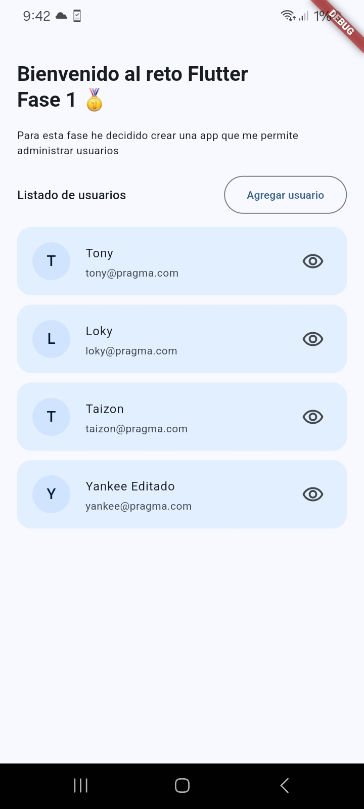
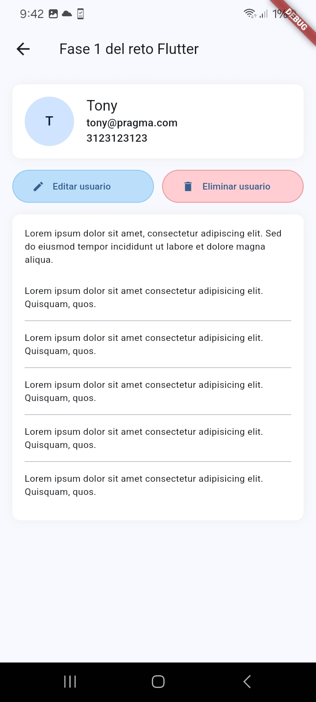
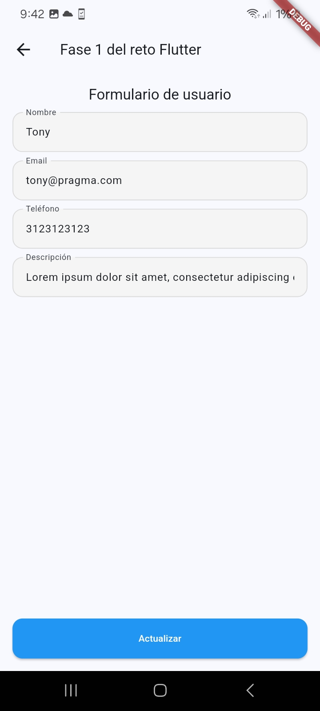

# Reto Flutter - Fase 1

Esta es mi solución a la fase 1 del Reto Flutter, la aplicación consiste en un CRUD de usuarios.
En el proyecto decidí usar una arquictectura que define de manera clara las responsabilidades de cada capa,
además de usar el patrón de diseño Provider para la gestión de estados.

## 📸 Capturas de Pantalla

<table>
  <tr>
    <td></td>
    <td></td>
    <td></td>
  </tr>
</table>

## 🛠️ Librerias usadas

- Provider para la gestión de estados
